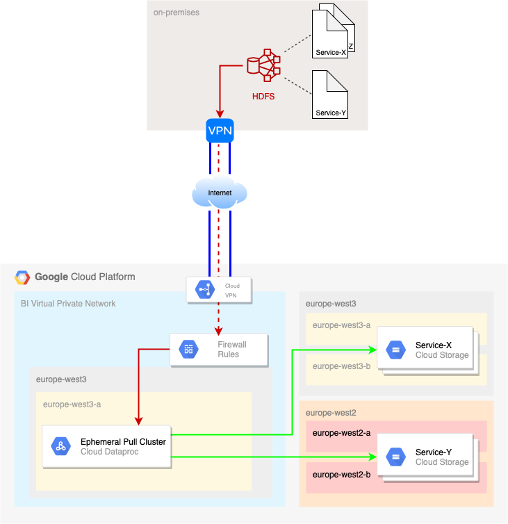
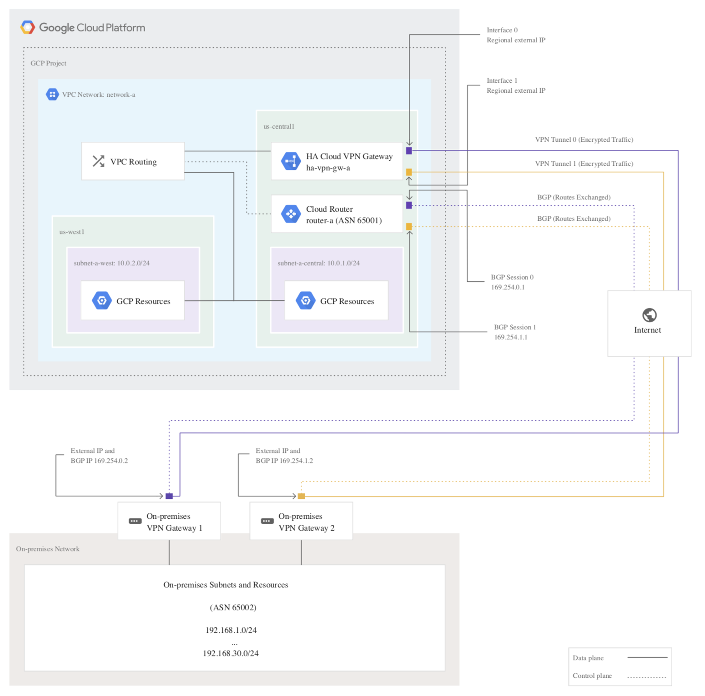
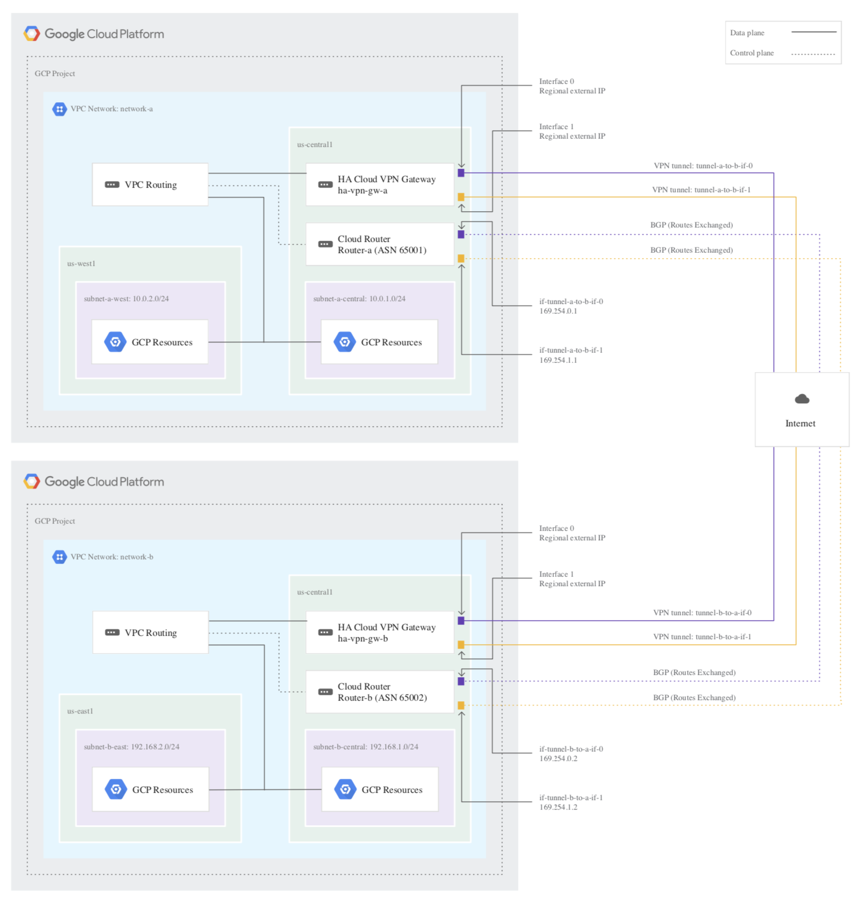

# Solution Design Task - Data migration from On-Prem to GCP
This repository contains the proposed high-level solution to migrate data from an existing On-Premise Hadoop Cluster to a new GCP Analytics platform.


# High-Level Solution

## Key principles

1. **"Lift and shift" data migration**
2. **Cloud Storage as a data lake**
3. **Data is pulled from On-Prem by ephemeral clusters in GCP**
4. **Data migration per Service and in stages** 
5. **Build new data ingestion pipelines into GCP**
6. **Ad interim double ingestion**

### 1. "Lift and shift" data migration
Data is migrated *AS-IS* from the On-Prem Hadoop cluster to an equivalent representation in GCS (Google Cloud Storage).

This approach has several benefits:
- it simplifies the migration strategy: for each main folder in HDFS there will be an equivalent bucket in GCS
- it ensures consistency between source data and migrated data. Moving from one environment/technology to another implies risks. A 1-2-1 migration reduces the risk to lose or alter the semantic of the data, e.g.: if data was organized in a certain folder structure and hierarchy that will be preserved
- the subsequent migration of the jobs will be very simple: jobs will have to be adjusted to point the resource used from hdfs://... to gs://...
- with this approach, the migration of the first service (or a similar test executed in preproduction) will help to determine with high precision the time required for the full migration

### 2. Cloud Storage as a data lake
GCS is well suited to serve as the central storage repository for many reasons. (Source: [Cloud Storage as a data lake](https://cloud.google.com/solutions/build-a-data-lake-on-gcp))

- Performance and durability: can store from few files to exabyte volumes with 11 Nines of durability.
- Strong consistency: almost all operations on data and metadata have strong consistency which means that the result of the operation produces an immediate effect after a success response from the platform. Access revocation instead can take up to one minute. Cache-control can have some discrepancies if not properly handled. [More details](https://cloud.google.com/storage/docs/consistency)
- Cost efficiency: several storage classes for several purposes (depending on the access frequency and the location/availability) together with lifecycle policies, allow controlling the storage costs. 
- Flexible processing: it's fully integrated with many GCP services simplifying the adoption of them
- Central repository: data is in one place only!
- Security: access control and encryption are built-in
  
*Disclaimer*: BigQuery is a service well suited for storing data too. For example, raw data could be stored in BigQuery. However, there shall be a consideration made around the data itself: BigQuery stores data in a denormalized form, meaning that if one raw data is normalized and gets loaded in BigQuery, BigQuery will create as many table raws as required to fully represent the original data. For example:

this JSON 

```
{
  "field1": "value1",
  "field2": "value2",
  "field3": "value3",
  "nested": {
    "nested1": "n_value1",
    "nested2": "n_value2",
    "nested3": "n_value3"
  }
}
```
once loaded in BigQuery will be represented as

```
--------------------------------------
| field1 | field2 | field3 | nested  |
--------------------------------------
| value1 | value2 | value3 | nested1 |
| value1 | value2 | value3 | nested2 |
| value1 | value2 | value3 | nested3 |
| value1 | value2 | value3 | nested4 |
--------------------------------------
```
with a clear increase in space allocation to store the object. Of course, the more normalized and complex the data the higher the space required to represent and store it in a denormalized form.

1.2PB of data costs ~ 30.000EURO a month to be stored in GCS. The "same amount" in BigQuery costs ~25.000EURO. It's apparently cheaper. However, once the data will be loaded in BigQuery and it will be denormalized, in case of complex data, the required space could multiply for a factor of 2, or 3 or even much more. The related cost for storage will follow this trend. 

This does not mean that BigQuery is not a valuable service for storing data. Actually, it provides extremely powerful features that are not possible in GCS and enables access to data in a much simpler way.

My final consideration is: BigQuery can be used as well, as long as it's clear the type of data that are going to be loaded in there and related consequences in terms of costs. Also, BigQuery can read data from GCS without the need for loading the data itself. Performance can be affected as a consequence, but it could be a good trade-off in certain cases where speed is not a requirement. 

Having the data migrated from On-Prem to GCS enables us to explore this option later.
  
### 3. Data is pulled from On-Prem by ephemeral clusters in GCP
Ephemeral Pull Dataproc Clusters will pull data from the OnPrem Hadoop Cluster (Source: [Migrating HDFS Data from On-Premises to Google Cloud Platform](https://cloud.google.com/solutions/migration/hadoop/hadoop-gcp-migration-data))

The official documentation describes and explains two approaches to copy data from HDFS to GCP (GCS): push model vs pull model. Both based on the usage of the DistCp command provided by Hadoop. The slightly bigger complexity to implement the pull model is paid back with a lot of **advantages**: 

* Impact on the source cluster's CPU and RAM resources is minimized because the source nodes are used only for serving blocks out of the cluster. You can also fine-tune the specifications of the pull cluster's resources on GCP to handle the copy jobs, and tear down the pull cluster when the migration is complete.
* Traffic on the source cluster's network is reduced, which allows for higher outbound bandwidths and faster transfers.
* There is no need to install the Cloud Storage connector on the source cluster as the ephemeral Cloud Dataproc cluster, which already has the connector installed, handles the data transfer to Cloud Storage.

To me, the biggest advantage is the following: migration to the cloud requires and enables a paradigm shift. We no longer need a monolithic Hadoop cluster running 24/7 and shared across all the services and propositions, with all the complexity that arises from that. We can instead spin up a dedicated cluster for each job that needs to be executed. A cluster fully tailored for the specific job that runs only for the duration of the job and it gets automatically destroyed after completion. The advantages are many, in terms of costs, maintenance and availability. Starting this paradigm shift and learning how to do it during the data migration phase put the right bases and builds the right knowledge to use it later for the BAU activities. 


### 4. Data migration per Service and in stages
Data should be migrated on a per Service base. And for each service, starting with the less important data and learning the process to do it.

Once data is migrated, a 1-2-1 migration of the related job can happen and whenever possible, using ephemeral clusters for their execution. This offers also a good opportunity to prove the consistency of the new results in the new environment.


### 5. Build new data ingestion pipelines into GCP
Possibly not in scope for this exercise but for sure required in the real scenario. 

New data ingestion pipelines have to be built to allow the migration to GCP. The TO-BE scenario assumes that new data will be ingested directly into GCP and having them implemented in parallel while migrating the data is one enabler that supports the last principle.


### 6. Ad interim double ingestion
This approach ensures the Analytics Service continuity while building the foundation for a seamless transition.

The idea is that already during the migration, data ingestion happens in both environments. The benefits are:

- possibly fewer data to be migrated. If the new ingestion pipelines work properly there is no need to transfer new data from On-Prem. In the worst-case instead, they will be available in the old environment and migrated when needed.
- all data is always available on-prem. This ensures service continuity
- when all the service data is migrated and the new ingestion pipelines are proved to work properly the legacy ingestion pipeline can be closed.


# High-level solution (DEMO) overview

This demo project uses Terraform to automate the creation of two environments in GCP, respectively the On-Prem environment (playing the role of the On-Prem environment) and the new GCP Analytics Platform which is the place where data needs to be migrated. 

## On-Prem environment
When created it's composed by:

- VPC (Virtual Private Cloud) in the europe-west3 region
- a subnetwork for the Hadoop Cluster in the europe-west3 region 
- a VPC Peering with the target environment
- a firewall rule which allows TCP outgoing traffic to the target cloud
- a firewall rule which allows SSH to machines in the cluster subnetwork
- a Hadoop Cluster with one master in the europe-west3 region
- a regional support bucket containing some sample data to be loaded in the On-Prem Hadoop cluster together with a script to load in Hadoop

## GCP target environment
When created it's composed by:

- VPC (Virtual Private Cloud) in the europe-west3 region
- a subnetwork for the Hadoop Cluster in the europe-west3 region 
- a VPC Peering with the target environment
- a support bucket containing import jobs required by the ephemeral pull cluster
- Dataproc Workflow Template used to generate the ephemeral pull cluster on job submission
- a GCS bucket where data will be migrated to

## High-level diagram



## Network TO-BE




## Network topology for the Demo



*Disclaimer:* for the sake of the demo, a VPC Peering between the two VPC has been implemented. 

# Demo

## Preconditions

- Terraform is installed
- there is an active service account with privileges to create and destroy resources
- the related service account key is downloaded and copied to the ./demo folder
- the Cloud Store service account is authorized to use the provided encryption key (in this case the service-x-crypto-key in the gcp-target-key-ring-3 key ring)

```
gsutil kms authorize -p onprem2gcp -k projects/onprem2gcp/locations/europe-west3/keyRings/gcp-target-key-ring-3/cryptoKeys/service-x-crypto-key
```

## Step 1
This is the preparation of the environments.

From folder "./demo/step1-create-environments" run 

```
terraform init
terraform apply
```

Verify that:
- on-prem and the target VPC have been created. [Verify](https://console.cloud.google.com/networking/networks/list?project=onprem2gcp)
- the related subnetworks exist in their respective VPCs
- there is peering between the VPCs. [Verify](https://console.cloud.google.com/networking/peering/list?project=onprem2gcp&peeringTablesize=50)
- there are two firewall rules. One to allow SSH on the Cluster and one to allow traffic from On-Prem to GCP. [Verify](https://console.cloud.google.com/networking/firewalls/list?project=onprem2gcp&firewallTablesize=50)
- there a Hadoop Cluster in the On-Prem subnetwork. [Verify](https://console.cloud.google.com/dataproc/clusters?project=onprem2gcp)
- there is a support bucket containing data which have been loaded in the On-Prem Hadoop Cluster. [Verify](https://console.cloud.google.com/storage/browser?project=onprem2gcp)
- verity that data is in Hadoop as described below

Connect to the Hadoop Cluster machine in ssh:

```
gcloud beta compute --project "onprem2gcp" ssh --zone "europe-west3-b" "on-prem-cluster-m" 
```

Once connected, run a few Hadoop commands. Eg:

```
hadoop fs -ls hdfs://on-prem-cluster-m/service-x/ 

or 

hadoop fs -cat hdfs://on-prem-cluster-m/service-x/raw/service-x-raw.json
```

We are now ready to import the data!

## Step 2

From folder "./demo/step2-create-pull-cluster-and-import" run 

```
terraform init
terraform apply
```


Verify that:

- there is a new bucket where data will be imported and it's empty. [Verify](https://console.cloud.google.com/storage/browser?project=onprem2gcp)
- there is a new Workflow Template. [Verify](https://console.cloud.google.com/dataproc/workflows/templates?project=onprem2gcp)
- a new ephemeral pull Hadoop Cluster is being created. [Verify](https://console.cloud.google.com/dataproc/clusters?project=onprem2gcp)
- there is a new Workflow Instance being executed. [Verify](https://console.cloud.google.com/dataproc/workflows/instances?project=onprem2gcp)

Once the job is completed, verify that:

- the ephemeral pull cluster has been deleted. [Verify](https://console.cloud.google.com/dataproc/clusters?project=onprem2gcp)
- data has been imported in the target bucket. [Verify](https://console.cloud.google.com/storage/browser/onprem2gcp-migrated-data-service-x?project=onprem2gcp)


# Answers to your questions

- **Your vision for the data analytics at GCP**
  
  **Answer**: Google is the best-in-class when it comes to data and its management. They sell to customers what's used internally for their proprietary services. The expectation is to have (almost) the same tools available to them to try and get the most values out of our data. Also, moving to GCP shall translate in spending less time handling the infrastructure while moving towards managed services. This means a reduction in operational costs. As mentioned above, a paradigm shift is required which will allow a refactoring of internal processes, tools and technologies. My biggest expectation, even if I am not an expert (yet), is that moving to GPC will build a strong foundation for a concrete introduction of AI and ML that could be more easily offered as a service to our customers. 
- **The GCP target architecture and the GCP technologies you have chosen**
    - Considering the storage technology on GCP and suggest which solution to use for raw and aggregated data and why?
  
        **Answer**: I have chosen Cloud Storage as the first place to migrate data to. Reasons are explained in detail in the second key principle. However, BigQuery has, to me, a big potential to be the central place where raw data is stored. The main reason is that it offers a very simple SQL like interface to accessing data that can be made available to our customers and allow them to create values from their data. This can completely replace legacy tool like Datameer and avoid those licenses cost while adding features which are not available yet in our existing Analytics platform like real-time analytics.
    - Draft a data architecture for storage layer with considering cost and performance aspects
      - Aggregation? Retention? Data classification?
      - Best practices & recommendation to use data for Analytics?
    
      **Answer**: At the beginning the storage layer is in Cloud Store and it's a replica of what exists in the Hadoop cluster on-prem. The Objects Lifecycle Management features offered by Cloud Storage allows setting rules for automatic storage class downgrade (eg: Standard Storage to Coldline Storage) or deletion after a certain period of time. Retention and cost optimizations are automated and ensured thanks to this feature there should no longer be the need to have dedicated jobs or processes for backup. Sensible data objects can be protected with additional ACL on top of the predefined bucket policies.
    - How do you implement data governance and security on GCP?
      - Control mechanism of granting access to data
        - Who access when & which data?
      - How to secure data due to GDPR compliance requirements?
        - Encryption solution? (Encryption on-fly in data stream <-> Encryption on persisted data
        
      **Answer**: The basic mechanism to providing access to GCP resource is through the IAM service which allows defining members (users/service accounts or groups), roles (primitive roles: owner, editor, viewer or custom roles) and permissions (bigtable.instances.create, storage.buckets.list, bigquery.jobs.get, ...) hence, "who can do what". In big organizations, where the number of entities (people, their functions and resources) is big, handling this aspect using IAM primitives could be extremely complex and error-prone. It's possibly convenient to explore the option of adopting a Data Governance Tool (Truedat, Collibra, talentd, ..) on top of the "raw data" which could also provide additional value on the data itself. With regards to Security instead, the usual best-practices shall always be applied: data in transit between components in the cloud shall be encrypted (HTTPS or mutual-TLS), connections over the Internet shall be secured inside VPN tunnels where data is additionally encrypted on top of the encryption provided by the protocol. Data at rest shall be encrypted and GCP provides several options for this problem from Google managed keys, to customer-managed keys to customer-supplied encryption keys. The correct option should be chosen as a trade-off between the sensibility of the data and the management effort that it's required (eg: in case of not Google managed key). 
- **Specific tasks and processes that benefit from the chosen GCP technologies**
  
  **Answer**: GCP itself enables much faster experimentation and adoption of new technologies and techniques. Object Lifecycle Management (GCS) enables automatic backup and deletion of data. Ephemeral Cluster (Dataproc) simplifies and optimizes the maintenance and execution of jobs. BigQuery enables simplified access to raw data and allows real-time analytics. 
- **Migration strategy**
  - How to automate data transfer of existing data on Hadoop to GCP?
  - What should be considered for the transit? (secure transit communication, file format?)
  
  **Answer**: The solution proposed in this demo is one possible way of migrating data. It's actually the one suggested by Google for moving data between an on-prem Hadoop cluster to GCP. [Another option](https://cloud.google.com/solutions/transferring-big-data-sets-to-gcp) could be a push model where data, with job executing in the on-prem environment, is first extracted from the Hadoop cluster, compressed and sent to the correct GCS bucket using the **gsutil**. There are implications that need to be taken into account in this scenario, eg: how much time and resources are needed to extract the data? What's the compression factor? Once received in GCP, data should be decompressed, what component does that? Does the overall process reduce the time to transfer data? These questions can be answered only with an experimental approach at scale, which has not been possible at this moment. 
- **Brief indication of milestones and timelines**
  
  **Answer**: 
  
    **Timelines**. With the setup of this demo (clusters with a master node only, machine type n1-standard4), copying one file of 1GB takes ~35 seconds. One to one, this translates in 486 days to transfer 1.2PB. In this scenario, the network latency is possibly negligible because there is a VPC Peering (hence, Google internal network) between the two environments. Many optimizations can be done: the dedicated resources on the pull cluster can be increased (eg: moving from n1-standard-4 to n1-standard-16, reduces the import time to ~20 seconds), the distcp command can also be optimized so to assign more memory to the mappers and the reducers. A fair expectation is that this performance can be improved by a factor of 2 or even 3, however the network latency is not known and that could become a bottleneck.
    It's worth to mention that, in the setup of this demo, copying the same file with gsutil takes ~20 seconds (faster apparently) but it should be measured and added on top of this value also the time required to extract this file from Hadoop, compress it, decompress it on the destination (and possibly also copy the decompressed data in the right bucket).  

    **Milestones**. I would imagine the followings:
    -   High-level design completion: this document should answer the question on which one is the right approach to transfer this amount of data and how to do it in practice. It should also cover the implementation of the new ingestion pipelines directly into GCP
    -   Technical readiness: the target environment is ready and all the tools and the process are available and automated
    -   Migration of the first service: while reaching this milestone we should collect data, learnings, improve the process (if possible) and rebase the success criteria
    -   Migration of the next X services by Y date: based on the new success criteria
    -   Full data migration completed: when all the services data are migrated and the new pipelines are ingesting data directly in GCP
    -   Start of architectural refactoring
- **Any special considerations for rolling out the proposed initiative**
  
  **Answer**: There are many unknowns this solution is built on and this is due to missing knowledge of the domain. For instance, what's the source network bandwidth? How many subfolders are contained in the service specific main folder? How many level deep? How many file in each leaf folder? How big is each file? In a real scenario, I would clarify all these points first and would try different approached before deciding which solution is best. In this case, due to these unknowns, I can fairly state that I am not fully confident about this solution and I am assuming that the guidelines from Google are the correct ones.
- **Criteria by which success will be determined**
  
  **Answer**: What determines the success of an initiative is normally the comparison of the actual results vs the predefined goals. The question becomes then, what are the goals? Quality, cost and time are the criteria that need to be set, monitored and reached. For me, an acceptable result would be to maintain the same costs, do the migration in the by the given milestone without any impact on the quality and the continuity of the service.  
- **Plans for extending the GCP roadmap to our advantage in the future**
  
  **Answer**: Have already mentioned through this document in a few places. Moving to GCP give the opportunity for a paradigm shift in many senses. Managed services allow more availability and garantee a stable level of quality of the services that we offer. Operational costs are reduced but only on the long run it will be proven if there is an actual overall cost reduction taking into account what's paid to Google for their services. BigQuery could replace Hadoop potentially, simplifying the architecture while introducing more capabilities. And again, Artificial Intelligence and Machine Learning could have solid bases in this ecosystem. One aspect that I believe is very true and tangible is the fact that working in the Cloud forces you to build solutions "as they should be": documentation, tutorial and articles somehow guide you to do things according to best practices that have been built in many years of experience. This is to me an unvaluable learning, personal but also from an organizational point of view. Returning to on-prem or keeping a parallel environment in a hybrid solution, will definitively benefit of this learning. 
